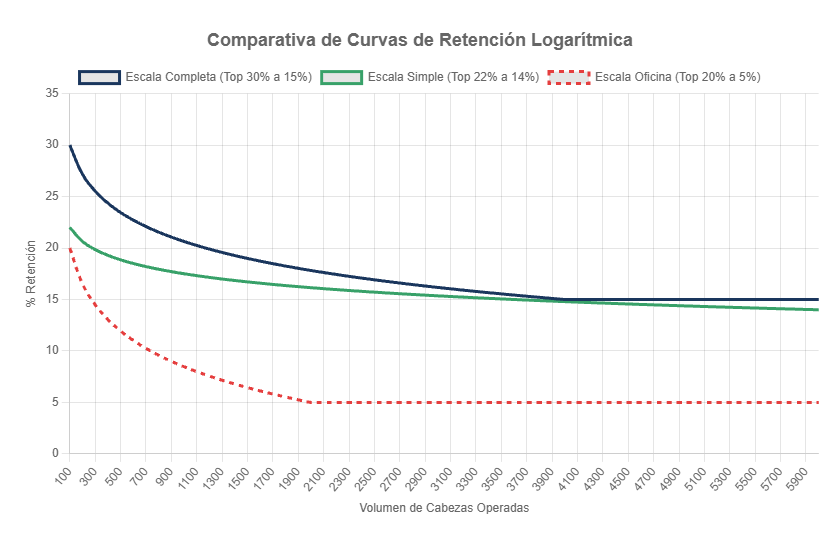
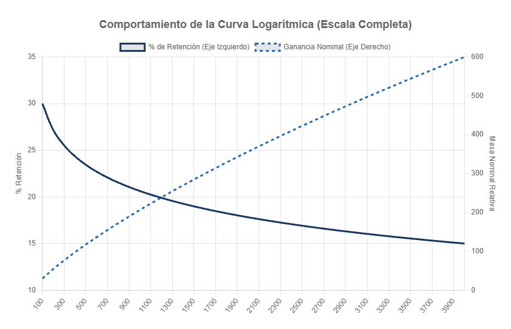

## Tablas de Escalas y Curvas

El cálculo de los componentes variables se rige por matrices predefinidas en el sistema. A continuación se detallan las curvas estándar y las configuraciones excepcionales.

***Nota visual:** El gráfico superior ilustra la caída logarítmica de los 3 modelos principales. La escala desciende rápidamente al principio para generar competitividad y luego estabiliza su caída hacia grandes volúmenes.*

### 1. Curvas de Componente Personal

El sistema de comisiones directas cuenta con dos curvas logarítmicas distintas, aplicadas según el perfil y modelo del comercial.

**¿Cómo funciona la fórmula logarítmica?**

La fórmula matemática exacta que rige este comportamiento en el sistema es la siguiente:

  <i>Porcentaje</i> = <i>Mínimo</i> + (<i>Máximo</i> &minus; <i>Mínimo</i>) &times; 
  [
  1 &minus; 
  
    
log(<i>Cabezas</i>) &minus; log(100)

    
log(<i>Tope</i>) &minus; log(100)

  
  ]

Donde:
- **Máximo:** El porcentaje de arranque para operaciones chicas (ej. 30%).
- **Mínimo:** El piso base donde se detiene la caída (ej. 15%).
- **Tope:** La cantidad máxima de cabezas donde se alcanza el porcentaje mínimo (ej. 4.000).
- **Cabezas:** El volumen total operado por el comercial en ese mes.

En palabras simples: la curva arranca entregándole al comercial el porcentaje máximo de retención cuando opera sus primeros animales. A medida que el volumen mensual de cabezas crece, el porcentaje de retención va descendiendo paulatinamente hasta llegar a un "piso" o tope mínimo. Esta caída no es recta (lineal), sino que forma una curva logarítmica: al principio el porcentaje baja rápido para incentivar la competitividad del precio al cliente, y luego se estabiliza, bajando cada vez más lento.

**¿Existe un punto de equilibrio donde ya no conviene operar más cabezas?**
**No. Matemáticamente, nunca deja de ser conveniente operar más volumen.**
Aunque el *porcentaje* de comisión sea cada vez menor, la **masa nominal ganada** (Cabezas operadas × Porcentaje) siempre crece. El diseño de la curva garantiza que operar un animal extra siempre sumará más dinero al bolsillo del agente. El sistema simplemente modera la velocidad de esa ganancia para proteger el margen corporativo en operaciones masivas.

***Nota visual sobre el gráfico:** La línea sólida oscura muestra cómo desciende el porcentaje de retención a medida que aumenta el volumen. La línea punteada clara representa la ganancia nominal relativa (dinero ganado): se puede observar que su trayectoria es siempre ascendente, demostrando matemáticamente que operar más volumen siempre incrementa el ingreso total, sin excepción.*

#### A. Escala Completa
Es la curva de retención principal, utilizada por los Modelos Completo, Híbrido y Variable (Rango: 30% al 15% con tope en 4.000 cabezas).

| Rango de Cabezas | Retención Aplicada (Aprox.) |
|:---:|:---:|
| 1 a 200 | **30,0%** |
| 201 a 500 | **26,3%** |
| 501 a 1.000 | **21,8%** |
| 1.001 a 2.000 | **18,4%** |
| 2.001 a 3.000 | **16,4%** |
| Más de 4.000 | **Tope Mínimo 15,0%** |

#### B. Escala Simple
Utilizada exclusivamente por los comerciales bajo el Modelo Simple (Rango: 22% al 14% con tope en 6.000 cabezas).

| Rango de Cabezas | Retención Aplicada (Aprox.) |
|:---:|:---:|
| 1 a 250 | **22,0%** |
| 251 a 1.000 | **19,5%** |
| 1.001 a 2.000 | **17,5%** |
| 2.001 a 4.000 | **15,5%** |
| Más de 6.000 | **Tope Mínimo 14,0%** |

### 2. Curva Provincial (Bolsa Regional)

La Escala Provincial toma el resultado bruto total de toda la región geográfica y le extrae un porcentaje para armar la Bolsa Regional.

| Rango de Cabezas Regionales | Retención Aplicada |
|:---:|:---:|
| 1 a 1.000 | **10,0%** |
| 1.001 a 5.000 | **8,0%** |
| 5.001 a 10.000 | **6,0%** |
| Más de 10.000 | **5,0%** |

### 3. Curva Institucional (Bolsa Oficina)

La Escala de Oficina se aplica sobre el volumen de ventas directas realizadas institucionalmente (sin un comercial asignado) que recaen físicamente dentro del área de influencia de la sucursal. Esta recaudación alimenta la Bolsa de Oficina, que luego se reparte en partes iguales entre los miembros exclusivos de dicha sede.

| Rango de Cabezas Directas | Retención Aplicada (Aprox.) |
|:---:|:---:|
| 1 a 200 | **20,0%** |
| 201 a 500 | **16,0%** |
| 501 a 1.000 | **10,0%** |
| 1.001 a 2.000 | **7,5%** |
| Más de 2.000 | **Tope Mínimo 5,0%** |

---

### Casos de Excepción y Reglas Customizadas

Existen comerciales que, por su rol estratégico o su modelo de negocio, no encajan al 100% en las reglas estándar de escalas y bolsas.

#### Caso "El Toro" (Modelo Variable Puro)
Aplica a representantes comerciales de muy alto riesgo.
- **Diferencia:** No tienen salario Mínimo Garantizado ($0).
- **Escala Personal:** Utilizan la **Curva AC** estándar (30% al 15%).
- **Excepción:** Su modelo es puramente individualista. Como no tienen un Mínimo Garantizado ni están bajo el esquema de una sucursal integral, **no participan de la Bolsa Regional ni de Oficina**. Operan con red de seguridad cero, cobrando estrictamente lo que producen personalmente.

#### Caso "Corporate" (Grandes Cuentas Institucionales)
Aplica a ejecutivos de grandes cuentas (KAM), enfocado en clientes frigoríficos o institucionales enormes.
- **Diferencia:** Tienen un Mínimo Garantizado altísimo (similar al Top AC Categoría 1), pero el flujo de sus negocios es totalmente distinto.
- **Escala Personal:** Tienen escalas y porcentajes fijados por **acuerdos directivos** a medida, que se inyectan como excepciones en el código.
- **Excepción:** Por defecto, **no participan** de las bolsas Regionales ni de Oficina, ya que sus cuentas no están ligadas a una capilaridad territorial provincial, sino a acuerdos B2B directos. Su liquidación se basa puramente en su Componente Personal y su Mínimo.
