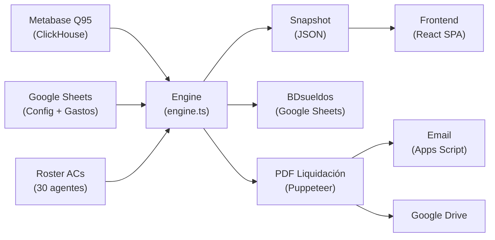

# 📋 Manual de la Aplicación — Cierres Regionales
## deCampoacampo · Plataforma de Liquidaciones Ganaderas

> **Versión**: 2.0 · **Fecha**: Junio 2026  
> **URL Producción**: https://cierres-regionales.vercel.app/  
> **Stack**: Express.js v5 + React + TypeScript + Google Sheets + Metabase + Puppeteer

---

## 📊 Resumen Ejecutivo

**Cierres Regionales** es una plataforma web interna que automatiza el cálculo mensual de comisiones (cierres) para los **Asociados Comerciales (ACs)** de deCampoacampo, una empresa de intermediación ganadera (compra-venta de ganado en pie).

### Métricas Clave del Sistema

| Dimensión | Valor |
|---|---|
| **Endpoints API** | 52 rutas HTTP |
| **Componentes Frontend** | 14 archivos React |
| **Fórmulas de Cálculo** | 22+ fórmulas financieras |
| **Líneas de Código Backend** | ~250,000 caracteres (engine + routes + APIs) |
| **Líneas de Código Frontend** | ~700,000 caracteres (componentes + estilos) |
| **Hojas de Google Sheets** | 20+ hojas en 8 spreadsheets |
| **Modelos de Comisión** | 6 predefinidos + custom |
| **Categorías de Mínimo** | 10 categorías configurables |

### Flujo de Datos Principal



---

## 🏗️ Arquitectura del Sistema

### Backend (`src/`)

| Carpeta/Archivo | Tamaño | Propósito |
|---|---|---|
| `src/server.ts` | 1.6KB | Entry point HTTP, monta routers |
| `src/index.ts` | 1KB | CLI batch runner (standalone) |
| **`src/core/`** | | **Motor de cálculo** |
| `core/engine.ts` | 70KB | Motor principal de comisiones |
| `core/inputs.ts` | 12KB | Lectura de Google Sheets |
| `core/normalization.ts` | 6KB | Roster de ACs + normalización |
| `core/calculator.ts` | 4KB | Escalas logarítmicas + mínimos |
| `core/models.ts` | 11KB | Modelos de comisión |
| `core/types.ts` | 5KB | Tipos TypeScript (129 campos) |
| `core/snapshot.ts` | 4KB | Persistencia de snapshots |
| `core/historical.ts` | 1KB | Datos históricos de sueldos |
| `core/regression.ts` | 4KB | Regresión OLS para calibración |
| `core/writer.ts` | 5KB | Escritura a BDsueldos |
| `core/pdf-template.ts` | 61KB | Template HTML para PDFs |
| `core/import-pdf-data.ts` | 11KB | Import de PDFs legacy |
| **`src/api/`** | | **Rutas y servicios externos** |
| `api/routes.ts` | 95KB | Rutas principales (25 endpoints) |
| `api/dispatch.ts` | 34KB | Envío de emails + PDFs (9 endpoints) |
| `api/metabase.ts` | 6KB | Integración Metabase |
| `api/sheets.ts` | 2KB | Operaciones Google Sheets |
| `api/drive.ts` | 11KB | Integración Google Drive |
| **`src/routes/`** | | **Config CRUD** |
| `routes/config.ts` | 12KB | CRUD Mínimos, Escalas, Tajada |
| `routes/config_models.ts` | 7KB | CRUD Modelos + Regresión |

### Frontend (`frontend/src/`)

| Componente | Tamaño | Propósito |
|---|---|---|
| `App.tsx` | 94KB | Router principal + estado global + tabla Resumen |
| `Hub.tsx` | 87KB | Dashboard landing con KPIs y tarjetas |
| `ConfigPanel.tsx` | 99KB | Panel admin (5 sub-tabs de configuración) |
| `VariablesHub.tsx` | 75KB | Dashboard de 13 variables de liquidación |
| `RedRegional.tsx` | 74KB | Métricas de Red Regional + PLM |
| `Simulator.tsx` | 60KB | Simulador what-if multi-slot |
| `ModelsGuide.tsx` | 55KB | Documentación interactiva + mini-simuladores |
| `Envios.tsx` | 39KB | Generación PDF + despacho email |
| `Comparator.tsx` | 27KB | Validador V3 vs V4 |
| `Estrategia.tsx` | 22KB | Visualización de estrategia |
| `Ajustes.tsx` | 12KB | Vista de ajustes retroactivos |
| `Wizard.tsx` | 11KB | Wizard de configuración |
| `SortableTable.tsx` | 8KB | Tabla genérica reutilizable |
| `MermaidChart.tsx` | 5KB | Wrapper de diagramas Mermaid |

---

## 🔢 Auditoría Completa de Cálculos

### Motor de Comisiones (`engine.ts`) — 22 Fórmulas

#### F1. Rendimiento (Yield)
```
rendimiento = round((resultadoFinal / baseImporte) × 10000) / 100
```

#### F2. Topes de Rendimiento
| Tipo | Mínimo | Máximo |
|---|---|---|
| Faena | -2% | 6% |
| Otros (Inv, Cría, MAG) | -4.5% | 8% |

```
Si rendimiento > MAX → resultado_ajustado = resultado × (MAX / rendimiento)
Si rendimiento < MIN → resultado_ajustado = resultado × (MIN / rendimiento)
```

#### F3. Reparto Venta / Compra
| Caso | Vendedor | Comprador | Descripción |
|---|---|---|---|
| Sin AC Venta | — | 1/3 | Sociedad propia (2/3 a pool oficina) |
| Ambos distintos | 2/3 | 1/3 | Normal |
| Doble punta | 3/3 | — | Mismo AC = 100% |
| Sin AC Compra | 2/3 | — | Solo venta |

#### F4. Escala Personal (Logarítmica)
```
cabezas = floor(cabezasRaw / 250) × 250  (cuantización a pasos de 250)
log100 = log₁₀(100)
logMax = log₁₀(topeCabezas)
logCab = log₁₀(max(cabezas, 1))
resultado% = minScale + (maxScale - minScale) × (1 - (logCab - log100) / (logMax - log100))
```

| Escala | Min% | Max% | Tope Cabezas |
|---|---|---|---|
| escalaAC | 15% | 30% | 4,000 |
| escalaPersonal | 14% | 22% | 6,000 |
| escalaProvincial | 5% | 10% | 15,000 |
| escalaOficina | 5% | 20% | 2,000 |

#### F5. Componente Personal (Estándar)
```
componenteP = resultado_final_ajustado × escalaPersonal(cabezas)
```

#### F6. Componente Personal (KAM / Frutos)
| Cuenta | Lado | % |
|---|---|---|
| Mermas (Faena) | Venta | 20% |
| Mermas (Otros) | Venta | 15% |
| Activación CI | Compra | 10% |
| Grandes Cuentas | Venta | 4% |
| Grandes Cuentas | Compra | 2% |

Vigencia: `diffMeses = (fechaOp - fechaAlta) / 30.44 días` → vigente si ≤ 8 meses.

#### F7. Componente Personal (Acuña)
```
ganancia = resultado_topeado × porcentaje_cuenta  (default 30%)
```

#### F8. Tajada Regional
```
tajada = sociedadesOperadasAC / sociedadesOperadasPool
```
(O override manual desde Config_Tajada)

#### F9. Componente Regional (Bolsa)
```
bolsaScale = escalaProvincial(cabezasRegionales)
Si Buenos Aires → bolsaScale = bolsaScale / 2

Completa:      compR = tajada × bolsaScale × resultadoRegional
City Manager:  compR = tajada × bolsaScale × resultadoRegional × 0.5
Operario:      compR = bolsaScale × resultado_propio
Custom:        compR = tajada × bolsaScale × resultadoRegional × pesoR
Simple/KAM:    compR = 0
```

#### F10. Componente Oficina
```
escalaOfi = escalaOficina(cabezasOficina)
participación = 1 / cantidadAgentesOficina

Completa:  compO = participación × escalaOfi × resultadoOficina
Custom:    compO = participación × escalaOfi × resultadoOficina × pesoO
Otros:     compO = 0
```
Oficinas elegibles: Río 4to, Entre Ríos, Bavio, Córdoba.

#### F11. Sueldo Bruto
```
Si componenteP < mínimo:
  variable_personal = 0
  componenteR = 0  (excepto David Menghi)
  componenteO = 0  (excepto David Menghi)
Sino:
  variable_personal = componenteP - mínimo

sueldoBruto = mínimo + variable_personal + componenteR + componenteO
```

#### F12. Amortización DCAC
```
amortización_mensual = round(amort_anual_2025 / 12)
Si vehículo empresa → 0
```

#### F13. Reintegro Movilidad
```
reintegroMovilidad = KMS_mes × precioPorKm(tipoVehículo)
Si vehículo empresa → 0
```

#### F14. Gastos Mendel (Tarjeta Corporativa)
```
gastosMkt = Σ(importe) de gastos Mendel del mes M-1
gastosMendelMovilidad = Σ(importe) categorías: Combustible, Service/Reparaciones, Peajes
```

#### F15. Reintegro Neto
```
reintegroNeto = reintegroMovilidad
Si tiene auto propio → reintegroNeto = reintegroNeto - gastosMendelMovilidad
```

#### F16. Ajuste Pablo Cieri
```
ajusteEspecial = componenteP × -0.20
```

#### F17. Aguinaldo (SAC)
```
Solo junio (6) y diciembre (12):
maxMínimo = max(mínimos_del_semestre)
aguinaldo = round(maxMínimo × 0.5)
```
Exentos: Acuña, Frutos, Pons, García, Lizazo.

#### F18. Cierre Real
```
totalComponentes = componenteP + componenteR + componenteO
sueldoFinal = max(mínimo, totalComponentes + ajustes) + aguinaldo
cierreReal = sueldoFinal + reintegroNeto - amortización + ajusteEspecial
```

#### F19. Ajuste Retroactivo
```
deltaResultado = resultado_dinámico - resultado_congelado
ajusteRetro = escala_congelada × deltaResultado
Umbral: |ajusteRetro| > $1
```

#### F20. CCC (Concreción Comercial por Canal)
```
CCC = cabezas_venta_concretadas / cabezas_venta_totales  (por canal)
Excluye: BAJA, PUBLICADO, NO CONCRETADAS, OFRECIMIENTOS, REVISAR
```

#### F21. Bonificación Oculta (por AC)
```
bonif_oculta = costoTotal_AC / importe_AC
```

#### F22. Regresión OLS (Calibración)
```
target = intercepto + coefP×P + coefR×R + coefO×O
R² = 1 - SSE/SST
RMSE = √(SSE / N)
Requiere N ≥ 4 agentes
```

---

## 🌐 Catálogo Completo de Endpoints API (52 rutas)

### Snapshots & Datos (12 rutas)

| # | Método | Ruta | Descripción | Estado |
|---|---|---|---|---|
| 1 | `GET` | `/api/snapshots` | Lista períodos con snapshot | ✅ Activo |
| 2 | `GET` | `/api/snapshots/:filename` | Devuelve snapshot de un período | ✅ Activo |
| 3 | `GET` | `/api/roster` | Lista ACs activos del roster | ✅ Activo |
| 4 | `POST` | `/api/roster` | Crea/actualiza un AC | ⚠️ Hardcoded Sheet ID |
| 5 | `GET` | `/api/retroactivos` | Ajustes retroactivos del período | ✅ Activo |
| 6 | `GET` | `/api/cuentas` | Cuentas especiales (KAM) | ✅ Activo |
| 7 | `POST` | `/api/cuentas` | Sobreescribe cuentas KAM | ⚠️ Sin validación |
| 8 | `GET` | `/api/mendel` | Gastos Mendel | ✅ Activo |
| 9 | `GET` | `/api/kms-prices` | Tabla de precios por km | ✅ Activo |
| 10 | `GET` | `/api/v3-salaries` | Sueldos V3 (BDSUELDO_REAL) | ✅ Activo |
| 11 | `GET` | `/api/historico/:agente` | Timeline completo de un AC | ✅ Activo |
| 12 | `GET` | `/api/market-metrics` | Métricas de mercado por UN | ✅ Activo |

### Generación de Cierres (2 rutas)

| # | Método | Ruta | Descripción | Estado |
|---|---|---|---|---|
| 13 | `POST` | `/api/generate` | Genera cierre completo del mes | ✅ Activo |
| 14 | `POST` | `/api/generate/agent` | Recalcula cierre de 1 AC | ✅ Activo |

### Ajustes Manuales CRUD (4 rutas)

| # | Método | Ruta | Descripción | Estado |
|---|---|---|---|---|
| 15 | `GET` | `/api/ajustes-manuales` | Lista ajustes manuales | ✅ Activo |
| 16 | `POST` | `/api/ajustes-manuales` | Crea ajuste manual | ✅ Activo |
| 17 | `PUT` | `/api/ajustes-manuales/:id` | Edita ajuste manual | ✅ Activo |
| 18 | `DELETE` | `/api/ajustes-manuales/:id` | Elimina ajuste manual | ⚠️ IDs por índice |

### Validación & Auditoría (3 rutas)

| # | Método | Ruta | Descripción | Estado |
|---|---|---|---|---|
| 19 | `GET` | `/api/validate` | Comparación V3 vs V4 | ✅ Activo |
| 20 | `GET` | `/api/revision/sociedad-sin-legajo` | Sociedades sin legajo correcto | ✅ Activo |
| 21 | `GET` | `/api/revision/concretadas-sin-cierre` | Concretadas sin cierre | ✅ Activo |

### Red Regional & Métricas (4 rutas)

| # | Método | Ruta | Descripción | Estado |
|---|---|---|---|---|
| 22 | `GET` | `/api/metricas-red` | Métricas por canal (más complejo) | ✅ Activo |
| 23 | `GET` | `/api/metricas-plm` | PLM por unidad de negocio | ✅ Activo |
| 24 | `GET` | `/api/minimos-red` | Análisis de subsidio mínimos | ✅ Activo |
| 25 | `POST` | `/api/migrate-ajustes` | Migración one-time | 🔒 Legacy |

### Despacho & PDFs (9 rutas)

| # | Método | Ruta | Descripción | Estado |
|---|---|---|---|---|
| 26 | `GET` | `/api/dispatch/config` | Config de envío del mes | ✅ Activo |
| 27 | `POST` | `/api/dispatch/config` | Guarda config + recalcula | ✅ Activo |
| 28 | `GET` | `/api/dispatch/preview-pdf/:agent` | PDF preview de un AC | ✅ Activo |
| 29 | `GET` | `/api/dispatch/preview` | HTML preview | ✅ Activo |
| 30 | `GET` | `/api/dispatch/preview-html/:agent` | Alias de preview | ✅ Activo |
| 31 | `POST` | `/api/dispatch/override/:agent` | Override HTML manual | ✅ Activo |
| 32 | `POST` | `/api/dispatch/test` | Envío test | ✅ Activo |
| 33 | `POST` | `/api/dispatch/send` | Envío real | ✅ Activo |
| 34 | `GET` | `/api/dispatch/health` | Health check Apps Script | ✅ Activo |

### Configuración CRUD (18 rutas)

| # | Método | Ruta | Descripción | Estado |
|---|---|---|---|---|
| 35-39 | CRUD | `/api/config/minimos` | Mínimos garantizados | ✅ Activo |
| 40-43 | CRUD | `/api/config/escalas` | Escalas de comisión | ✅ Activo |
| 44-46 | CRD | `/api/config/tajada` | Tajada regional | ✅ Activo |
| 47-51 | CRUD | `/api/config-models/*` | Modelos + escalas custom | ✅ Activo |
| 52 | `POST` | `/api/config-models/regression/calibrate` | Calibración OLS | ✅ Activo |

---

## 🖥️ Componentes Frontend — Glosario Funcional

### 1. App.tsx — Router & Estado Global

| Estado | Tipo | Descripción |
|---|---|---|
| `activeTab` | `string` | Tab activa: hub, cierre, variables, simulador, envios, comparador, config, manuales, roster, ajustes |
| `activeYear/Month` | `number` | Período seleccionado |
| `data` | `object` | Respuesta principal del API (cuentas, mendel, kms, roster) |
| `cierreData` | `array` | Snapshot del cierre actual |
| `loading` | `boolean` | Spinner global |
| `minimosData` | `array` | Análisis de mínimos mensuales |

**Cálculos en tabla Resumen:**
- `sueldoBruto = componenteP + ajustes + componenteR + componenteO`
- `cierreReal = max(sueldoBruto, minimo) + movilidad - amortización`
- Deltas vs mes anterior con colores condicionales

### 2. Hub.tsx — Dashboard Principal

**6 KPI Cards:**
1. Agentes Activos (count + oficinas)
2. Cuentas (total cuentas especiales)
3. Mendel (total gastos corporativos)
4. Cierre (cerrados/sin cerrar)
5. Tajada (sociedades operadas)
6. Mínimos (agentes en mínimo + subsidio)

**10 Feature Cards:**
1. Armar Cierre → sub-menú con links
2. Métricas Red → RedRegional component
3. Métricas PLM → PLM sub-tab
4. Historial Comerciales → timeline + chart + Drive PDFs
5. Ajustes Retroactivos → vista de ajustes
6. Manuales → documentación
7. Revisión → validadores (Sociedad Sin Legajo, Concretadas Sin Cierre)
8. Gastos Mendel → explorador con filtro por período
9. Análisis Mínimos → evolución mensual de subsidios
10. Roster Comercial → tab del roster

### 3. RedRegional.tsx — Métricas de Red

| Estado | Tipo | Descripción |
|---|---|---|
| `periodType` | `string` | MES, Q1-Q4, H1, H2, AÑO |
| `matrixCategory` | `string` | Filtro: OVERALL, INVERNADA, FAENA, CRÍA |
| `expandedChannel` | `string` | Canal expandido en detalle |
| `activeSubTab` | `string` | canales / plm |
| `plmViewType` | `string` | percent, cabezas, rendimiento, importe, resultado |

**Cálculos clave:**
- Agregación multi-mes con promedio ponderado para CCC y bonifPct
- Cruces de canal venta×compra con heat-map
- Bonif Oculta = Costo / Importe por AC
- YoY = (actual - anterior) / anterior × 100

### 4. VariablesHub.tsx — Dashboard de Variables

**13 tarjetas expandibles:**

| # | Card | Descripción | Cálculo Principal |
|---|---|---|---|
| 1 | Componente P | Comisión personal | Σ componenteP |
| 2 | Tajada | Regional share | Σ tajadaRegion |
| 3 | Oficina | Componente oficina | Σ componenteO |
| 4 | Ajustes | Retroactivos + manuales | CRUD con recálculo |
| 5 | Escalas | Escalas logarítmicas | Tabla de escalas vigentes |
| 6 | Mínimos | Garantías salariales | Count(cierreReal ≤ mínimo) |
| 7 | Tropas | Cabezas/tropas | Σ tropas, Σ cabezas |
| 8 | Rendimiento | % promedio | avg(rendimientoGen) |
| 9 | Sociedades | Soc por tajada | Σ socOpGen |
| 10 | Gastos | Movilidad | Σ gastos + KMS |
| 11 | Sueldo Bruto | Bruto total | Σ sueldoBruto |
| 12 | Cierre Real | Neto total | Σ cierreReal |
| 13 | Costo Red | Costo total red | bruto + amort + reintegros + mendel |

### 5. ConfigPanel.tsx — Panel de Configuración

**5 sub-tabs:**

| Tab | Datos | Operaciones |
|---|---|---|
| Mínimos | Categoría × período × monto | CRUD + clonación masiva con % ajuste |
| Escalas | Tipo × período × min/max% × tope | CRUD |
| Tajada | Oficina × comercial × % | Create + Delete |
| Modelos | 6 predefinidos + custom con P/R/O | CRUD + calibración OLS (R², coeficientes) |
| Ajustes | Manuales + Retroactivos | CRUD manuales + auditoría retro |

### 6. Simulator.tsx — Simulador de Comisiones

**Inputs por Unidad de Negocio (5 UNs):**
- Invernada, Faena, Cría, MAG: cabV, cabC, importe, rendimiento%
- Pool: cabezas pool, importe pool, rendimiento pool, cabezas directas, miembros

**4 modelos de simulación:** Completo, Híbrido, Corporate KAM, General

**Fórmula `calcModel`:**
```
resultado = (cabV + cabC) × importe × (rendimiento/100)
escalaP = getScale(cabezas, tipo)
compP = resultado × escalaP
cobraMin = compP < baseMin
variableP = cobraMin ? 0 : (compP - baseMin)
compR = poolRes × escalaR × tajada (si no en mínimo)
compO = bolsaO / miembros (si no en mínimo)
bruto = baseMin + variableP + compR + compO
```

### 7. ModelsGuide.tsx — Explorador de Fórmulas

**8 secciones con mini-simuladores:**
1. Componente Personal — slider de escala logarítmica
2. Topes de Rendimiento — visualización de caps
3. Reparto Venta/Compra — split 2/3 vs 1/3
4. Componente Regional — bolsa × tajada × resultado
5. Movilidad — KMS × precio - Mendel
6. Cuentas Especiales — Acuña (30%), Frutos (GC rates)
7. Mínimo Garantizado — absorción + tabla de categorías
8. Ajustes Retroactivos — ejemplo M-1/M-2/M-3

### 8. Envios.tsx — Despacho de Liquidaciones

- Editor HTML WYSIWYG (iframe designMode)
- Preview/generación PDF por agente
- Envío de email con Drive integration
- Override HTML almacenado en backend

### 9. Comparator.tsx — Validador V3 vs V4

- Comparación lado a lado: snapshot engine vs Google Sheets
- Detección de desvíos por agente (%, absoluto)
- Clasificación: ok / minor / major (umbral $50K)

### 10-14. Componentes Auxiliares

| Componente | Propósito |
|---|---|
| `Estrategia.tsx` | Visualización de workflows con Mermaid |
| `Ajustes.tsx` | Vista embebida de ajustes retroactivos |
| `Wizard.tsx` | Wizard de configuración paso a paso |
| `SortableTable.tsx` | Tabla genérica con sort + formato |
| `MermaidChart.tsx` | Wrapper de renderizado Mermaid |

---

## 🗄️ Fuentes de Datos Externas

### Google Sheets (8 spreadsheets)

| Variable ENV | Contenido | Hojas Principales |
|---|---|---|
| `TARGET_SPREADSHEET_ID` | Salida principal | BDsueldos, Sys_Snapshots, Sys_Config, BDSUELDO_REAL |
| `HUB_SPREADSHEET_ID` | Configuración | Config_Minimos, Config_Escalas |
| `HUB_CONFIGURACIONES_ID` | Ajustes | Ajustes |
| `HUB_GASTOS_ID` | Gastos | BDGASTOS, KMS, Kms & $, Amort_DCAC |
| `HUB_CIERRES_ID` | Cierres | Bajada_Estatica, Ajustes_Retro, Detalle_Retro, Config_Tajada, Envio_Reportes, Historial_Envios |
| `MASTER_ROSTER_ID` | Roster | Asociados Comerciales (30 columnas) |
| `MENDEL_SPREADSHEET_ID` | Mendel | Base Mendel, Correlaciones |
| `SOURCE_SPREADSHEET_ID` | Legacy | Migración (legacy) |

### Metabase

| Card | Descripción | Cache |
|---|---|---|
| #298 (Q95) | Operaciones ganaderas completas | 1 hora |
| SQL directo | Fechas de asignación de ACs | Disco |

### Google Drive

| Recurso | Propósito | Cache |
|---|---|---|
| `CIERRES_ROOT_FOLDER_ID` | PDFs de liquidaciones | 1 hora |
| Estructura: Año → Mes → PDFs | Navegación jerárquica | — |

---

## ⚙️ Estrategia de Cache

| Recurso | TTL | Tipo | Invalidación |
|---|---|---|---|
| Q95 (Metabase) | 1 hora | In-memory | Automática |
| Roster ACs | Sin TTL | In-memory | `invalidateRosterCache()` manual |
| V3 Salaries | 1 hora | In-memory | Automática |
| Drive Links | 1 hora | In-memory | Automática con fallback a expirado |
| Config (Mínimos/Escalas) | 60 seg | In-memory | Automática |
| AC Assignment Dates | Sin TTL | Disco JSON | Manual |
| Inputs (Gastos, KMS...) | Sin cache | Fetch directo | — |

---

## 🔍 Diagnóstico de Funciones

### ✅ Funciones Activas y Correctas

| Función | Ubicación | Estado |
|---|---|---|
| Motor de cálculo principal | `engine.ts` | ✅ Operativo |
| 6 modelos de comisión | `models.ts` | ✅ Operativo |
| Escala logarítmica | `calculator.ts` | ✅ Operativo |
| Snapshot save/load | `snapshot.ts` | ✅ Operativo |
| Generación PDF | `pdf-template.ts` | ✅ Operativo |
| CRUD Mínimos/Escalas/Tajada | `config.ts` | ✅ Operativo |
| CRUD Modelos custom | `config_models.ts` | ✅ Operativo |
| Regresión OLS | `regression.ts` | ✅ Operativo |
| Envío email (Apps Script) | `dispatch.ts` | ✅ Operativo |
| Métricas Red Regional | `routes.ts` | ✅ Operativo |
| Métricas PLM | `routes.ts` | ✅ Operativo |
| Validador V3↔V4 | `routes.ts` | ✅ Operativo |
| Simulador multi-slot | `Simulator.tsx` | ✅ Operativo |
| Period aggregation (Q/H/AÑO) | `RedRegional.tsx` | ✅ Operativo |

### ⚠️ Observaciones y Riesgos

| # | Tema | Ubicación | Severidad | Detalle |
|---|---|---|---|---|
| 1 | **Sheet ID hardcoded** | `routes.ts` POST /roster | 🟡 Media | Usa literal `1FpgyFCw2hibi3w_jArtohKUxPhvfUpnF9SDDI3YI-aI` en vez de `config.MASTER_ROSTER_ID` |
| 2 | **Sin autenticación** | Todas las rutas | 🔴 Alta | No hay auth middleware. Cualquiera con la URL puede ejecutar endpoints |
| 3 | **CORS abierto** | `server.ts` | 🟡 Media | `cors()` sin restricción de origen |
| 4 | **Body limit 50MB** | `server.ts` | 🟡 Media | Excesivo para JSON API |
| 5 | **IDs por índice** | CRUD Ajustes/Minimos/Escalas | 🟡 Media | Race condition si 2 usuarios eliminan simultáneamente |
| 6 | **Fórmula duplicada** | `routes.ts`, `dispatch.ts` | 🟡 Media | `cierreReal` calculado en 3 lugares distintos (no DRY) |
| 7 | **Hardcoded Pablo Cieri** | `engine.ts`, `routes.ts`, `dispatch.ts` | 🟡 Media | -20% en 3 archivos. Debería ser configurable |
| 8 | **Hardcoded David Menghi** | `engine.ts` | 🟢 Baja | Excepción para mantener R+O aunque esté en mínimo |
| 9 | **Email test hardcoded** | `dispatch.ts` | 🟢 Baja | `sdewey@decampoacampo.com` fijo |
| 10 | **Sin rate limiting** | Todas las rutas | 🟡 Media | Sin protección contra abuso |
| 11 | **Escala duplicada** | `Simulator.tsx`, `ModelsGuide.tsx`, `calculator.ts` | 🟡 Media | Misma fórmula logarítmica implementada 3 veces independientemente |
| 12 | **Sin state management** | Frontend | 🟢 Baja | Prop drilling desde App.tsx, sin Redux/Zustand/Context |
| 13 | **Archivos muy grandes** | `ConfigPanel.tsx` (99KB), `App.tsx` (94KB) | 🟢 Baja | Dificulta mantenimiento |
| 14 | **POST /cuentas sin validación** | `routes.ts` | 🟡 Media | Sobreescribe JSON sin validar estructura |
| 15 | **SAC exentos hardcoded** | `engine.ts` | 🟢 Baja | Lista fija de 5 nombres exentos de aguinaldo |
| 16 | **Oficinas elegibles hardcoded** | `engine.ts` | 🟢 Baja | Lista fija de 3 oficinas para Componente O |

---

## 📚 Glosario de Términos del Negocio

| Término | Significado |
|---|---|
| **AC** | Asociado Comercial — intermediario ganadero |
| **Cierre** | Liquidación mensual de comisiones |
| **Componente P** | Comisión personal sobre resultado de operaciones |
| **Componente R** | Comisión regional (bolsa provincial) |
| **Componente O** | Comisión de oficina (pool compartido) |
| **Tajada** | Participación % en la bolsa regional |
| **Mínimo** | Sueldo mínimo garantizado por categoría |
| **CCC** | Concretación Comercial por Canal |
| **Bonif Oculta** | Costo AC / Importe generado |
| **Rendimiento** | Yield = resultado / importe × 100 |
| **Tope** | Límite superior/inferior de rendimiento |
| **Tropas** | Lotes de ganado operados |
| **Cabezas** | Cantidad de animales en una tropa |
| **UN** | Unidad de Negocio: Invernada, Faena, Cría, MAG |
| **KAM** | Key Account Manager (cuentas especiales) |
| **Mendel** | Gastos de tarjeta corporativa |
| **SAC** | Sueldo Anual Complementario (aguinaldo) |
| **Doble Punta** | AC en ambos lados (venta+compra) |
| **PLM** | Product Line Management |
| **Q95** | Query principal de Metabase (#298) |
| **Roster** | Nómina maestra de ACs (30 columnas) |
| **Snapshot** | Foto congelada del cierre de un mes |
| **Retroactivo** | Ajuste por diferencia entre snapshot y recálculo |
| **Bolsa** | Pool de resultados regionales/oficina |
| **Escala** | Curva logarítmica de comisión vs volumen |

---

## 📖 Glosario Técnico Completo — Funciones por Archivo

### `src/core/engine.ts` (3 exports)

| Función | Tipo | Parámetros | Retorno | Descripción |
|---|---|---|---|---|
| `classifyChannel` | Función | acName, repreName, dbChannel, roster | `string` | Clasifica canal comercial: REGIONAL, REPRESENTANTE, COMISIONISTA, DIRECTO |
| `calculateDynamicMonth` | Async | year, month | `CommercialResult[]` | Motor principal: calcula comisiones de todos los ACs para un mes |
| `calculateRetroactiveAdjustments` | Async | year, month | `RetroactiveAdjustment[]` | Calcula diferencias entre snapshot congelado y datos actuales |

### `src/core/inputs.ts` (9 exports)

| Función | Tipo | Retorno | Descripción |
|---|---|---|---|
| `cleanSheetsNumber` | Función | `number` | Parsea formato español ("1.200.000,50" → 1200000.5) |
| `fetchGastos` | Async | `GastoEntry[]` | Lee BDGASTOS de Sheets |
| `fetchAjustesManuales` | Async | `AjusteEntry[]` | Lee ajustes manuales |
| `fetchTajada` | Async | `any[]` | Lee Config_Tajada |
| `fetchKms` | Async | `KmsEntry[]` | Lee KMS mensuales |
| `fetchPreciosKm` | Async | `Map<string,number>` | Lee precios por km por tipo vehículo |
| `fetchVehicleMap` | Async | `Map<string,string>` | Mapeo comercial → vehículo |
| `fetchAmortDcac` | Async | `AmortEntry[]` | Lee amortizaciones vehiculares |
| `fetchMendelGastos` | Async | `MendelGasto[]` | Lee gastos tarjeta corporativa |

### `src/core/normalization.ts` (3 exports)

| Función | Tipo | Retorno | Descripción |
|---|---|---|---|
| `getRoster` | Async | `Map<string, RosterEntry>` | Carga y cachea roster de 30 columnas |
| `normalizeName` | Async | `string\|null` | Normaliza nombre contra roster canónico |
| `invalidateRosterCache` | Sync | `void` | Limpia cache del roster |

### `src/core/calculator.ts` (4 exports)

| Función | Tipo | Retorno | Descripción |
|---|---|---|---|
| `interpolateLogScale` | Sync | `number` | Interpolación logarítmica (legacy, sin usar) |
| `loadConfig` | Async | `void` | Carga Config_Minimos y Config_Escalas (TTL 60s) |
| `getMinimumForCategory` | Async | `number` | Mínimo garantizado por categoría/período |
| `getExactScale` | Async | `number` | Escala logarítmica: cabezas → % comisión |

### `src/core/models.ts` (7 exports)

| Función | Tipo | Retorno | Descripción |
|---|---|---|---|
| `loadCustomScales` | Async | `Record<string,CustomScale>` | Carga escalas custom de Sys_Config |
| `saveCustomScales` | Async | `void` | Persiste escalas custom |
| `loadCustomModels` | Async | `Record<string,CommissionModel>` | Carga modelos custom |
| `saveCustomModels` | Async | `void` | Persiste modelos custom |
| `getModelByModalidad` | Async | `CommissionModel` | Resuelve modalidad → modelo completo |
| `resolveScalePct` | Async | `number` | Resuelve % de escala (fija, estándar, o custom tramos) |
| `getAllModels` | Async | `array` | Lista todos los modelos para UI |

### `src/core/regression.ts` (1 export)

| Función | Tipo | Retorno | Descripción |
|---|---|---|---|
| `runRegression` | Sync | `RegressionResult` | OLS: target = intercepto + coefP×P + coefR×R + coefO×O |

### `src/core/snapshot.ts` (3 exports)

| Función | Tipo | Retorno | Descripción |
|---|---|---|---|
| `saveMonthSnapshot` | Async | `void` | Guarda snapshot chunkeado en Sheets (45K/chunk) |
| `loadMonthSnapshot` | Async | `CommercialResult[]\|null` | Carga y re-ensambla snapshot |
| `loadAllSnapshots` | Async | `Record<string,CommercialResult[]>` | Carga todos los snapshots |

### `src/core/writer.ts` (1 export)

| Función | Tipo | Retorno | Descripción |
|---|---|---|---|
| `updateDynamicSueldos` | Async | `void` | Escribe 50 columnas a BDsueldos preservando otros meses |

### `src/core/historical.ts` (1 export)

| Función | Tipo | Retorno | Descripción |
|---|---|---|---|
| `fetchHistoricalSalaries` | Async | `HistoricalSalaryEntry[]` | Lee sueldos históricos de BDSUELDO_REAL |

### `src/api/sheets.ts` (6 exports)

| Función | Tipo | Retorno | Descripción |
|---|---|---|---|
| `getSheetsClient` | Sync | `SheetsClient` | JWT auth con scopes spreadsheets + drive.readonly |
| `readSheet` | Async | `any[][]` | Lee con UNFORMATTED_VALUE |
| `writeSheet` | Async | `void` | Escribe con USER_ENTERED |
| `appendSheet` | Async | `void` | Append con INSERT_ROWS |
| `clearSheetRange` | Async | `void` | Limpia rango |
| `createSheetIfNotExists` | Async | `void` | Crea tab si no existe |

### `src/api/metabase.ts` (4 exports)

| Función | Tipo | Retorno | Descripción |
|---|---|---|---|
| `getMetabaseSession` | Async | `string` | Auth token (cache 110 min) |
| `fetchCard` | Async | `any[]` | Fetch genérico de card Metabase |
| `fetchQ95` | Async | `any[]` | Card #298 con cache 1hr + fallback |
| `fetchAcAssignmentDates` | Async | `Record<string,string>` | SQL directo: fechas de asignación |

### `src/api/drive.ts` (9 exports)

| Función | Tipo | Retorno | Descripción |
|---|---|---|---|
| `getDriveClient` | Sync | `DriveClient` | Read-only scope |
| `getDriveWriteClient` | Sync | `DriveClient` | drive.file + drive scopes |
| `listDriveFolders` | Async | `array` | Lista subcarpetas (max 100) |
| `listDriveFiles` | Async | `array` | Lista PDFs (max 500) |
| `getCierreLinks` | Async | `Map<string,string>` | Mapeo agente_YYYYMM → link (cache 1hr) |
| `getOrCreateYearFolder` | Async | `string` | Busca/crea carpeta Año |
| `getOrCreateMonthFolder` | Async | `string` | Busca/crea carpeta Mes |
| `uploadPdfToDrive` | Async | `object` | Upload + permiso público reader |
| `deleteDriveFile` | Async | `void` | Elimina archivo |

### `src/api/dispatch.ts` (6 helpers internos)

| Función | Tipo | Retorno | Descripción |
|---|---|---|---|
| `getLocalTimestamp` | Sync | `string` | Timestamp Argentina |
| `getAgentData` | Async | `CommercialResult\|null` | Busca AC en snapshot |
| `getAgentConfig` | Async | `object\|null` | Config de envío del AC |
| `adjustAgentDataWithConfig` | Sync | `void` (muta) | Aplica config de envío al resultado |
| `generatePdfBuffer` | Async | `Buffer` | HTML → PDF vía Puppeteer |
| `sendViaAppsScript` | Async | `object` | Envía email + PDF via Apps Script |

---

## 📐 Tipos TypeScript Principales

### `CommercialResult` (129 campos)

**Identidad:** idUsuario, mail, fechaCierre, año, mes, añoMes, asociadoComercial, codigo, provincia, partido, oficina, tipo, modalidad, escalasTexto, categoria

**Componente Personal:** tropasGeneral, cabezasGeneral, cabzGenVenta/Compra, importeGen, resultado_final, resultado_final_ajustado, escalaGen, componenteP

**Desglose por UN:** resInv/InvNeo/Faena/Cria/Mag, cabInv/InvNeo/Faena/Cria/Mag

**Componente Regional:** tropas/cabezas/cabz/importeReg, resultadoReg, bolsaRegion, tajadaRegion, componenteR

**Componente Oficina:** tropas/cabezas/cabz/importeOfi, resultadoOfi, escalaOficina, opOficina, componenteO

**Ajustes:** ajustes, ajustesManuales, aguinaldo, cierreMesM1/M2/M3, extras

**Gastos:** rendimientoGen, cccGen, socOpGen, amortizacionAP, kms, auto, precioPorKm, reintegroMovilidad, gastosMkt, amortizacioneDcac, gastosDetalle[]

**KAM:** grandesCuentas, mermas, activacionCIS

**Finales:** fijo, variable_personal, sueldoBruto, resultado, minimo, cierreReal

**Operaciones:** operacionesIds[], operacionesDetalle[]

### `OperacionDetalle` (33 campos)
Detalle por operación: id_lote, tipo, fecha, sociedades, cantidades, importes, resultado, asignaciones, bonificaciones, rendimiento real/topeado, escala_aplicada, ganancia_personal_venta/compra, canal_venta/compra

### `RetroactiveAdjustment` (14 campos)
Registro retroactivo: año, mes, comercial, identidad, mesAjustado, añoAjustado, escalaCongelada, resultadoCongelado/Dinámico, deltaResultado, ajusteComponenteP, detalleLotes[]

### `CommissionModel` (7 campos)
Modelo de comisión: id, nombre, tieneMinimo, descripcion, componenteP (config), componenteR (config), componenteO (config)

### `RosterEntry` (30+ campos)
Perfil completo del AC: nombre, código, provincia, partido, oficina, tipo, modalidad, escalas, activo, link, tier, ingreso, mail, auto, mendel, responsableDC, operadores por UN, beneficios, categoría, grupoFamiliar, lat/long, departamento, CUIT, pctMinimo

---

> **Documento generado automáticamente** por auditoría exhaustiva del código fuente.  
> Última actualización: Junio 2026
