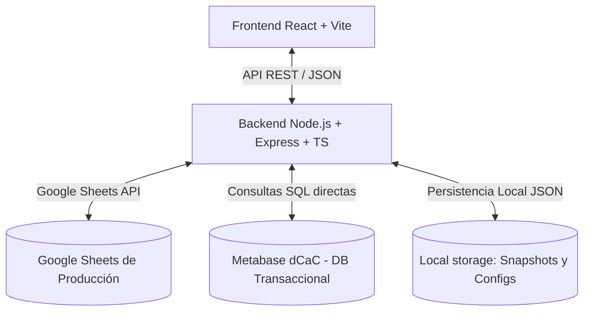

# Manual Completo de la Aplicación Web — Cierres Regionales

Este documento constituye la especificación funcional, técnica y matemática definitiva de la plataforma de **Cierres Regionales** de **deCampo a Campo (dCaC)**. Ha sido diseñado para servir como fuente de verdad absoluta de consulta para el equipo de Control de Gestión, Recursos Humanos, Desarrolladores y Comerciales, eliminando cualquier tipo de duda sobre el funcionamiento del sistema, sus fórmulas y sus datos.

---

## 1. Arquitectura General y Flujo de Datos

La aplicación está diseñada bajo un modelo cliente-servidor desacoplado y sin base de datos relacional pesada, apoyándose en archivos de configuración local (JSON) y APIs de servicios externos.



### 1.1 Persistencia de Datos Locales (Directorio `src/core/data/`)
El backend utiliza archivos JSON estructurados para la persistencia local de configuraciones personalizadas y snapshots históricos:
1. **`cuentas.json`**: Contiene la lista de cuentas especiales (como Acuña y Frutos) con sus CUITs, Razones Sociales, AC asignados y porcentajes de comisiones aplicables a sus operaciones de compra/venta.
2. **`custom_scales.json`**: Almacena las escalas de comisiones por tramos creadas por el usuario (e.g. Escala Pringles).
3. **`custom_models.json`**: Guarda las definiciones de los modelos customizados paramétricos (Componentes P, R, O activos, multiplicadores y mínimos garantizados).
4. **Directorio `snapshots/`**: Almacena archivos en formato `Snapshot_YYYYMM.json` con la foto estática de la liquidación de cada mes una vez cerrada. Estos snapshots congelan la información de roster, variables, operaciones, comisiones calculadas y montos finales para auditorías y recálculos retroactivos futuros.

---

## 2. Integración con Google Sheets (Planilla de Gestión)

La aplicación lee variables y escribe cierres en el Google Sheet de Producción (definido por el ID `HUB_CIERRES_ID` en el archivo `.env`).

### 2.1 Mapeo de Pestañas y Columnas
El motor consume las siguientes solapas de la planilla:

#### A. Pestaña `'Roster'`
Contiene la nómina activa de asociados comerciales y sus reglas contractuales:
- **`Comercial`**: Nombre completo del agente (debe coincidir exactamente con el nombre de Metabase).
- **`Email`**: Dirección de correo electrónico del comercial (utilizado para el envío de cierres en PDF).
- **`Activo`**: Estado del agente (`TRUE` o `FALSE`).
- **`Oficina`**: Nombre de la oficina física a la que pertenece (e.g., "Bahía Blanca", "Pringles").
- **`Categoría`**: Número del 1 al 10 indicando su nivel de mínimo garantizado (1 = Top AC, 6 = Sin Mínimo, 7+ = Operario Carga).
- **`Modalidad`**: Modelo contractual de comisiones asignado (e.g., "Simple", "Completo", "Híbrido", "Oficina Repre").
- **`Fijo` / `Mínimo`**: Remuneración básica o sueldo mínimo garantizado.
- **`Auto DCAC`**: Booleano (`TRUE` / `FALSE`) indicando si posee vehículo provisto por la empresa (lo que anula el reintegro de movilidad).
- **`Amortización`**: Booleano indicando si cobra amortización fija en lugar de reintegro por KMS.

#### B. Pestaña `'ESCALAS RAC AC'`
Proporciona los valores de sueldos mínimos garantizados vigentes para cada categoría de roster del mes.
- Columnas: `Categoría`, `Mínimo Garantizado ($)`.

#### C. Pestaña `'Kms & $'`
Almacena los kilómetros declarados por el Roster y los precios de movilidad:
- **Precios de Combustible/KM** (Fila superior): Precios de reintegro por kilómetro según tipo de vehículo:
  - `Auto`: Valor monetario por KM.
  - `SUV`: Valor monetario por KM.
  - `Camioneta`: Valor monetario por KM.
- **Detalle de Agentes**:
  - `Comercial`: Nombre del agente.
  - `Kms`: Kilómetros recorridos en el periodo de liquidación.
  - `Tipo Auto`: Tipo de vehículo (`auto`, `suv` o `camioneta`).

#### D. Pestaña `'Base Mendel'`
Registra los gastos transaccionales realizados por los agentes con la tarjeta corporativa Mendel:
- **`Comercial`** / **`Usuario`**: Nombre del comercial.
- **`Monto`** / **`Importe`**: Gasto transaccional en pesos.
- **`Estado`**: Solo se computan los gastos con estado `Aprobado` o `Confirmado`.
- **`Periodo`**: Mes de imputación en formato `YYYYMM`.

#### E. Pestaña `'Historico'`
Registra lo efectivamente liquidado y pagado en meses anteriores para el cálculo de ajustes retroactivos:
- Columnas: `Comercial`, `Año`, `Mes`, `Sueldo Cobrado ($)`.

#### F. Pestaña `'Ajustes_Manuales'`
Almacena premios o deducciones manuales del periodo corriente ingresados por Control de Gestión:
- Columnas: `id` (autoincremental), `comercial`, `año`, `mes`, `monto`, `motivo`.

#### G. Pestaña `'Bajada_Estatica'`
Registra la bajada consolidada histórica de tropas que se congela mes a mes para las auditorías retroactivas.

### 2.2 Sanitización y Limpieza de Datos Financieros (`cleanSheetsNumber`)
Los usuarios suelen ingresar números con símbolos de moneda, espacios y puntos en Google Sheets. Para evitar errores de parseo (`NaN` o `0`), el backend implementa una sanitización exhaustiva en `src/core/inputs.ts`:
```typescript
export function cleanSheetsNumber(val: any): number {
  if (val === undefined || val === null) return 0;
  if (typeof val === 'number') return val;
  let str = String(val).trim();
  if (!str) return 0;
  // Elimina $, espacios, puntos de miles
  str = str.replace(/\$/g, '')
           .replace(/\s/g, '')
           .replace(/\./g, '');
  // Reemplaza la coma decimal por punto decimal
  str = str.replace(/,/g, '.');
  const num = parseFloat(str);
  return isNaN(num) ? 0 : num;
}
```

---

## 3. Integración con Metabase (Base de Datos Q95)

La aplicación ejecuta una query SQL optimizada contra la base de datos transaccional de Metabase para obtener el volumen consolidado del mes corriente y de los 3 meses anteriores (M-1, M-2, M-3).

### 3.1 Filtros y Campos Extraídos
De cada operación (lote de ganado/tropas) se extraen los siguientes campos fundamentales:
- **`id`**: Identificador único del lote.
- **`año` / `mes`**: Fecha de concreción de la operación.
- **`asociado_comercial_id_vend` / `AC_Vend`**: Nombre del AC vendedor.
- **`asociado_comercial_id_comp` / `AC_Comp`**: Nombre del AC comprador.
- **`cantidad` / `cabezas`**: Cantidad física de cabezas operadas.
- **`resultado_final`**: Margen bruto o utilidad en pesos generada por el lote.
- **`rendimiento`**: Porcentaje de utilidad sobre el importe total de compra/venta.
- **`tipo_operacion`**: Clasificación del lote (`INVERNADA`, `FAENA`, `CRIA`, `MAG`).
- **`sociedad_vendedora` / `sociedad_compradora`**: CUITs y nombres de las razones sociales de los clientes.

### 3.2 Lógica de Resolución y Reasignación Canónica de Asociados Comerciales
En Metabase, el AC asignado a una tropa puede estar desactualizado o ser genérico. El motor aplica un orden de prioridad riguroso para resolver quién es el agente real responsable (AC OK):
1. **Regla por Legajo**: Si el CUIT de la sociedad compradora/vendedora está mapeado a un legajo específico en el maestro de sociedades, ese agente se asigna de forma prioritaria.
2. **Regla por Sociedad**: Si la razón social coincide con el mapeo en `cuentas.json`, se asigna el comercial correspondiente de dicha cuenta.
3. **Regla por Representante (Fallback)**: Si no hay reasignación por legajo ni sociedad, se respeta el AC registrado en Metabase.

---

## 4. El Motor de Liquidación (Fórmulas Matemáticas y Reglas de Negocio)

La liquidación bruta mensual de cada comercial ($i$) se rige por la siguiente ecuación general:

$$\text{Sueldo Bruto}_i = \text{Sueldo Garantizado (Fijo)}_i + \text{Variable Personal (P)}_i + \text{Componente Regional (R)}_i + \text{Componente Oficina (O)}_i$$

---

### 4.1 Componente Personal (P)

Representa la comisión individual basada en las cabezas operadas y el resultado neto de los lotes.

#### A. Curvas de Escala Logarítmica Estándar
Para los modelos tradicionales (`Simple`, `Completo`), el motor calcula el porcentaje de escala de forma continua y logarítmica a partir de las cabezas totales operadas por el agente en el mes:

$$pct = minScale + (maxScale - minScale) \times \left(1 - \frac{\log_{10}(cabezas) - \log_{10}(100)}{\log_{10}(maxCabezas) - \log_{10}(100)}\right)$$

Donde los parámetros varían según la escala asignada:
- **Escala Asociado Comercial Estándar (`escalaAC`)**:
  - $maxScale = 30\%$, $minScale = 15\%$, $maxCabezas = 4000$.
- **Escala Personal Oficina (`escalaPersonal`)**:
  - $maxScale = 22\%$, $minScale = 14\%$, $maxCabezas = 6000$.
- **Escala Provincial (`escalaProvincial`)**:
  - $maxScale = 10\%$, $minScale = 5\%$, $maxCabezas = 15000$.
- **Escala Oficina Directa (`escalaOficina`)**:
  - $maxScale = 20\%$, $minScale = 5\%$, $maxCabezas = 2000$.

*Reglas de Acotamiento:*
- Si $cabezas < 100$, el porcentaje se fija en $maxScale$.
- Si $cabezas \ge maxCabezas$, el porcentaje se fija en $minScale$.
- Las cabezas se redondean al múltiplo de $250$ inferior para mantener la escala por tramos discretos.

#### B. Escalas por Tramos Customizadas (e.g. Oficina Pringles)
Para modelos custom parametrizados, el usuario define tramos discretos de comisiones (guardados en `custom_scales.json`). El motor busca el tramo correspondiente a las cabezas operadas:
- Si $cabezas < \text{Umbral Mínimo}$ (e.g. $1,500$ cabezas en Pringles) $\rightarrow pct = 0\%$.
- A partir del umbral, se busca el tramo en la tabla ordenada:
  - $1500 \rightarrow 1.50\%$
  - $1750 \rightarrow 1.75\%$
  - $\dots$
  - $5250+ \rightarrow 5.25\%$

El valor final de la componente personal se obtiene de:

$$\text{Componente Personal (P)} = \sum (\text{Resultado Ajustado del Lote} \times \text{Part. Agente}) \times pct$$

Donde la participación es:
- **$2/3$ ($66.67\%$)** si el agente es el vendedor.
- **$1/3$ ($33.33\%$)** si el agente es el comprador.
- **$3/3$ ($100\%$)** si el agente es vendedor y comprador (Doble Punta).

---

### 4.2 Topes de Rendimiento (%)
Para proteger el flujo de caja ante negocios outlier o márgenes sobredimensionados, el motor audita el **rendimiento** (%) de cada operación de forma previa a calcular la comisión:

$$\text{Rendimiento (\%)} = \frac{\text{Resultado Bruto}}{\text{Volumen de Venta}}$$

Se aplican los siguientes límites según el tipo de operación:
- **Invernada / Cría**: Mínimo $-4.5\%$, Máximo $8.0\%$.
- **Faena**: Mínimo $-2.0\%$, Máximo $6.0\%$.

Si el rendimiento real supera el límite, el resultado de la operación se ajusta proporcionalmente:

$$\text{Resultado Ajustado} = \begin{cases} 
\text{Resultado Base} \times \frac{\text{Límite Máximo}}{\text{Rendimiento Real}} & \text{si } Rendimiento > L\acute{\imath}mite\ M\acute{a}ximo \\
\text{Resultado Base} \times \frac{\text{Límite Mínimo}}{\text{Rendimiento Real}} & \text{si } Rendimiento < L\acute{\imath}mite\ M\acute{\imath}nimo \text{ (y } Rendimiento \neq 0\text{)} \\
\text{Resultado Base} & \text{en otro caso}
\end{cases}$$

---

### 4.3 Componente Regional (R)
Es un premio colectivo que incentiva la colaboración regional. Se calcula agrupando las operaciones de todos los agentes de una misma oficina física:

1. **Resultado Provincial**: Suma del resultado ajustado de todas las tropas operadas en la provincia.
2. **Cabezas de la Oficina**: Suma del volumen físico de todas las oficinas de esa zona.
3. **Bolsa Regional**: Se calcula aplicando la curva `escalaProvincial` sobre las cabezas de la oficina. 
   - *Excepción:* Si la oficina está radicada en la Provincia de **Buenos Aires**, la bolsa calculada se **divide por 2** debido al alto volumen transaccional de la zona.
4. **Tajada del Agente**: Porcentaje de participación individual sobre la bolsa regional:

$$\text{Tajada} = \frac{\text{Sociedades Únicas Operadas por el Agente}}{\text{Sociedades Únicas Totales de la Oficina}}$$

$$\text{Componente Regional (R)} = \text{Bolsa Regional} \times \text{Tajada} \times \text{Resultado Provincial} \times \text{Peso Regional Modelo}$$

*Excepciones de Roster:*
- Los **Operarios de Carga** (Categorías 7, 8, 9, 10) reciben un **10% fijo** de su propia facturación como Componente Regional en lugar de participar en el reparto de la bolsa regional de la oficina.

---

### 4.4 Componente Oficina (O)
Es el premio por el rendimiento de la oficina física en zonas elegibles:

$$\text{Componente Oficina (O)} = \text{Participación Oficina} \times \text{Escala Oficina} \times \text{Resultado Oficina} \times \text{Peso Oficina Modelo}$$

---

### 4.5 Regla del Mínimo Garantizado (Regla de Absorción)
Para los agentes que tienen un mínimo activo (Categorías 1 a 5, y modelos custom con mínimo habilitado), el motor aplica la **Regla de Absorción**:

1. Se evalúa si la componente personal calculada ($P$) supera el sueldo mínimo correspondiente a su categoría ($Minimo$):
   - **Caso A: $P < Minimo$**
     - El agente **no llega al mínimo** y cobra el sueldo mínimo garantizado como un pago fijo.
     - La variable personal final pasa a ser **$0$**.
     - **Penalización**: Se **pierden** los premios adicionales de Componente Regional (R) y Componente Oficina (O). Cobra únicamente el Fijo.
   - **Caso B: $P \ge Minimo$**
     - El agente supera el mínimo. Cobra el sueldo mínimo garantizado.
     - Se le paga el excedente como variable personal: $\text{Variable Personal} = P - Minimo$.
     - **Premio**: Cobra las componentes R y O completas.
2. *Excepciones Contractuales:*
   - **David Menghi** posee un acuerdo especial en el roster: aunque no supere el mínimo (cobrando el fijo), mantiene el derecho a cobrar los premios Regional y Oficina completos.
   - **Sin Mínimo (Categoría 6)**: No poseen básico ni absorción. Cobran el 100% de su variable personal ($P$) desde la primera cabeza, más los premios de R y O sin penalizaciones.

---

## 5. Módulo de Regresión Lineal OLS (Calibración del Motor)

Módulo matemático que implementa **Mínimos Cuadrados Ordinarios (OLS)** para analizar los desvíos históricos y calibrar los pesos sugeridos para las componentes salariales.

### 5.1 Planteo Matemático de la Regresión
El modelo postula que el sueldo cobrado históricamente por los agentes ($Y$) puede explicarse como una combinación lineal de las componentes calculadas por el motor ($P$, $R$, $O$), más un término de error ($\epsilon$):

$$Y = w_0 + w_p \cdot P + w_r \cdot R + w_o \cdot O + \epsilon$$

Donde:
- $Y$: Sueldo real cobrado (leído de la pestaña `Historico`).
- $P, R, O$: Comisiones calculadas por el motor para el mismo periodo.
- $w_0$: Intercepto o sueldo básico base sugerido.
- $w_p, w_r, w_o$: Coeficientes de peso o multiplicadores óptimos.

### 5.2 Algoritmo de Mínimos Cuadrados y Eliminación Gaussiana
Para calcular el vector de pesos $\mathbf{w} = [w_0, w_p, w_r, w_o]^T$, resolvemos la ecuación matricial normal:

$$\mathbf{X}^T \mathbf{X} \mathbf{w} = \mathbf{X}^T \mathbf{Y}$$

Donde:
- $\mathbf{X}$ es la matriz de diseño de tamaño $N \times 4$ (con una columna de 1s para el intercepto).
- $\mathbf{Y}$ es el vector de sueldos históricos de tamaño $N \times 1$.

El backend en `src/core/regression.ts` realiza los siguientes pasos de cálculo:
1. **Transposición**: Calcula $\mathbf{X}^T$.
2. **Multiplicación**: Calcula la matriz de coeficientes $\mathbf{A} = \mathbf{X}^T \mathbf{X}$ (de $4 \times 4$) y el vector $\mathbf{B} = \mathbf{X}^T \mathbf{Y}$ (de $4 \times 1$).
3. **Resolución**: Aplica **Eliminación Gaussiana con pivoteo parcial** para resolver el sistema lineal de $4 \times 4$:

$$\mathbf{A} \mathbf{w} = \mathbf{B}$$

4. **Coeficiente de Determinación ($R^2$):** Evalúa la calidad de ajuste del modelo matemático:

$$R^2 = 1 - \frac{\sum (Y_i - \hat{Y}_i)^2}{\sum (Y_i - \bar{Y})^2}$$

Donde $\hat{Y}_i$ es la predicción del modelo y $\bar{Y}$ es la media de los sueldos históricos. Un $R^2 \ge 0.90$ indica una excelente precisión de correlación.
El usuario puede calibrar el motor en un solo click aplicando los pesos calculados ($w_p, w_r, w_o$) de forma directa en la configuración del motor.

---

## 6. Módulo de Ajustes Manuales e Informe Retroactivo por Tropa

El sistema gestiona de forma exhaustiva los desvíos generados por actualizaciones posteriores en la facturación de Metabase (como tropas concretadas con retraso o modificaciones de montos/cabezas).

### 6.1 Auditoría Dinámica vs. Estática
Cada mes que se realiza un cierre, el motor congela un snapshot estático del periodo. Al calcular el periodo activo actual, el motor re-ejecuta de forma transparente las liquidaciones de los 3 meses anteriores (M-1, M-2, M-3) utilizando las consultas en tiempo real de Metabase (**Bajada Dinámica**).

- Si los resultados de una tropa histórica sufrieron alteraciones en Metabase, se detecta el desvío comparándola contra la **Bajada Estática** congelada en el snapshot del mes correspondiente.
- El ajuste se calcula aplicando la **Escala Congelada** que tenía el comercial en el mes en el que se concretó la operación:

$$\text{Ajuste Retroactivo} = (\text{Resultado Neto Dinámico} - \text{Resultado Neto Estático}) \times \text{Escala Congelada}$$

### 6.2 Clasificación de Estados de Tropa
El validador inspecciona lote por lote y clasifica las variaciones retroactivas detectadas bajo tres estados:
1. **`Nueva`**: La tropa no existía en el snapshot estático congelado pero aparece en la bajada dinámica de Metabase. El ajuste se calcula como:

$$\text{Ajuste} = \text{Resultado Dinámico} \times \text{Escala Congelada}$$

2. **`Modificada`**: La tropa existe en ambos registros pero cambiaron las cabezas, el importe de compra/venta, el resultado bruto o el AC asignado. El ajuste se calcula por la diferencia neta de su utilidad final.
3. **`Bajada`**: La tropa estaba registrada en el snapshot congelado pero ya no figura en la bajada dinámica de Metabase (eliminación de facturación). El ajuste descuenta la comisión pagada en su momento:

$$\text{Ajuste} = 0 - (\text{Resultado Estático} \times \text{Escala Congelada})$$

### 6.3 Línea de Impacto Consolidada
Para evitar distorsionar el procesamiento operativo mensual, **los desgloses y variaciones detalladas de las tropas pasadas solo se muestran en la pantalla de auditoría e información**. 
Al cálculo del mes activo del comercial únicamente se le suma la **línea de impacto neta consolidada** (el total acumulado de desvíos de M-1, M-2 y M-3) bajo el concepto de ajuste retroactivo. De esta forma, el cierre actual se mantiene limpio, ordenado y libre de redundancia operacional.

---

## 7. Glosario de Pantallas y Funcionalidades del Frontend

### 7.1 Hub Principal
- **KPIs Rápidos**: Tarjetas interactivas con acceso directo a listados consolidados (Agentes activos, Cuentas Especiales, Gastos de Movilidad Mendel, Estado de Cierres, Análisis de Subsidio en Mínimos y Tabla de Tajadas reales de oficinas).
- **Consola de Operaciones**: Panel de control para navegar entre Roster Comercial, Historial de Comerciales pasados y la pantalla centralizada de **Manuales**.

### 7.2 Manuales y Centro de Descargas
- **Manuales y Descargas (Tab Principal)**: Acceso y descargas de los manuales de referencia en formato PDF de alta definición con un solo click.
- **Explorador de Fórmulas (Tab Secundario)**: Simulador interactivo que permite ingresar cabezas y resultados para modelar curvas logarítmicas, verificar topes de faena/invernada en tiempo real y simular la absorción del mínimo garantizado.

### 7.3 Liquidación y Cierre
- Tabla interactiva que consolida la liquidación del Roster Comercial.
- Desglose detallado columna por columna de Componentes P, R, O, Ajustes manuales del periodo, Ajustes retroactivos calculados y Sueldo Bruto Final.
- Botón **"Congelar Período / Generar Snapshot"**: Acción administrativa que archiva la foto del mes actual como estática en disco y en la planilla Google Sheets.

### 7.4 Ajustes Retroactivos y Manuales
- **Formulario Premios/Descuentos**: Carga rápida de ajustes manuales para el mes corriente.
- **Visor Retroactivo**: Muestra el desvío neto de M-1, M-2 y M-3 por comercial y permite desplegar el acordeón de tropas para auditar los lotes modificados, nuevos o dados de baja.
